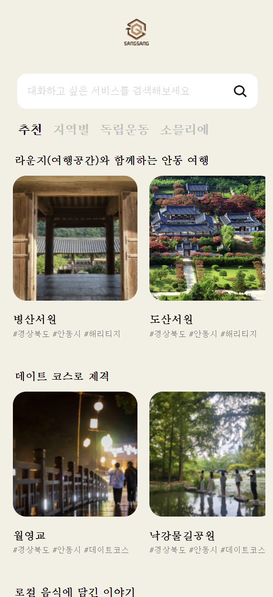
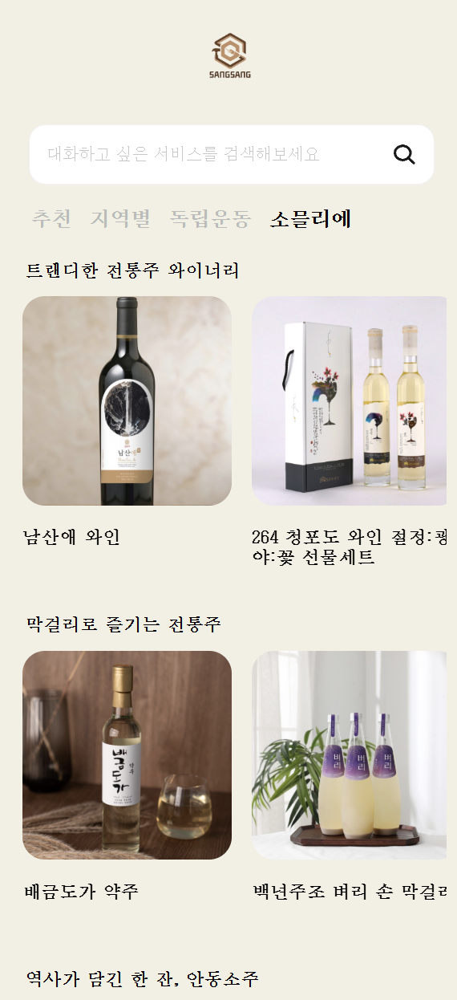
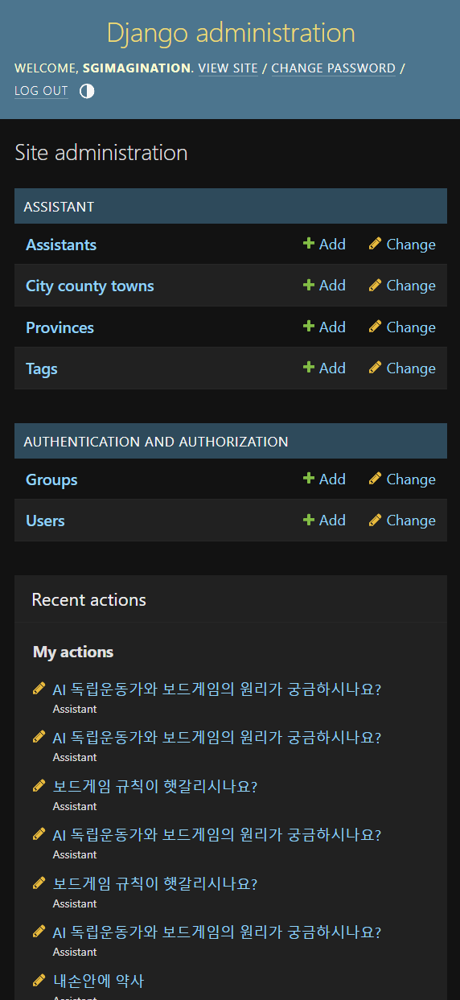
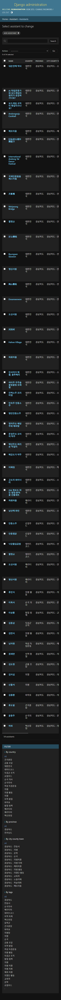
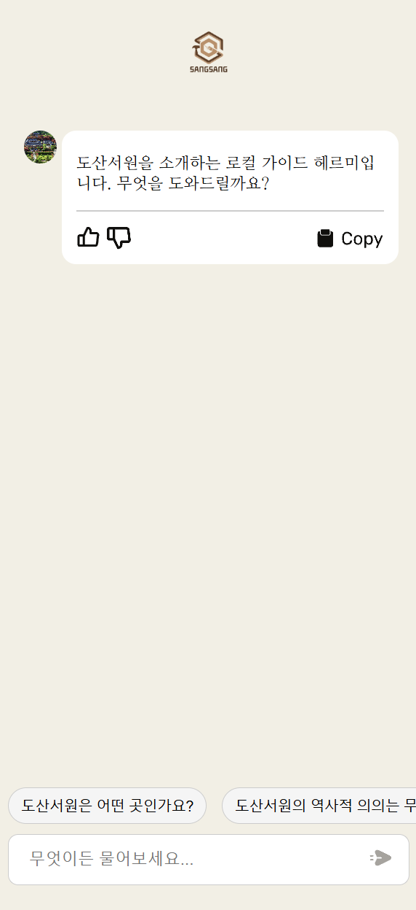
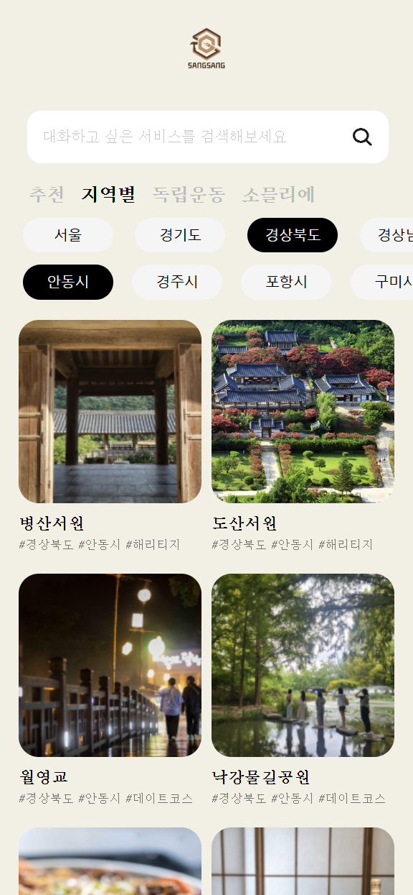

# 대한민국 지역문화 챗봇 시스템

## 프로젝트 소개
이 프로젝트는 대한민국 각 지역의 문화유산, 역사적 인물, 관광 명소, 전통 정보를 사용자에게 전달하기 위한 챗봇 기반 정보 제공 시스템입니다. 
주요 목표는 사용자가 간단한 대화형 인터페이스를 통해 다양한 지역문화를 탐색하고, 깊이 있는 정보를 제공받을 수 있도록 하는 것입니다. OpenAI API를 활용하여 자연어 처리 기술을 적용하였으며, 웹과 모바일 사용자 모두에게 최적화된 인터페이스를 제공합니다.

## 주요 화면
### 메인 페이지
<div style='width:50%;'></div>
- 지역별 추천 콘텐츠를 메인 화면에서 확인 가능하며, 직관적인 UI를 통해 원하는 지역과 주제를 탐색할 수 있습니다.

### 소믈리에 페이지

- 전통주와 관련된 정보를 제공하며, 사용자 맞춤 추천 서비스를 통해 관심 있는 주제를 더욱 깊이 탐색할 수 있습니다.

### 관리자 페이지



- 관리자 모드에서는 지역, 카테고리, 콘텐츠 데이터를 효율적으로 관리할 수 있습니다.

### 채팅 페이지

- 사용자와 챗봇 간의 대화 화면으로, 지역 문화와 관련된 질문에 빠르고 정확한 답변을 제공합니다.

### 독립운동 페이지

- 독립운동과 관련된 역사적 인물 및 사건 정보를 제공하며, 사용자 학습을 돕습니다.

### 지역별 페이지

- 특정 지역에 대한 상세 정보 및 추천 콘텐츠를 제공합니다.

## 주요 기능
1. **지역문화 정보 제공**
   - 대한민국 지역별 문화유산, 독립운동가, 전통술 등을 포함한 상세 정보 제공.
   - 사용자 맞춤형 콘텐츠 추천 기능.

2. **챗봇 시스템 연동**
   - OpenAI GPT-4 API를 활용하여 자연스러운 대화형 인터페이스 구현.
   - 사용자의 질문을 분석하여 적절한 답변 제공.

3. **관리자 기능**
   - 관리자 페이지에서 데이터 관리 및 콘텐츠 추가.
   - 효율적인 데이터베이스 관리 및 유지보수.

4. **대화 세션 관리**
   - 지속적인 대화 흐름 유지 및 새 대화 시작 시 맥락 초기화 기능.

5. **배포 및 운영**
   - Vultr 클라우드 플랫폼에 NGINX와 Gunicorn을 이용한 배포.
   - 안정적인 서버 운영 및 유지보수.

## 기술 스택
- **백엔드**: Django, Django REST Framework
- **API**: OpenAI API
- **프론트엔드**: HTML, CSS, jQuery, AJAX
- **배포 및 운영**: NGINX, Gunicorn, Vultr
- **버전 관리**: Git

## 프로젝트 구조
```
region-culture-chatbot/
├── chatbot/                 # 챗봇 관련 로직 및 API
├── core/                    # 프로젝트 설정 및 공통 기능
├── frontend/                # 프론트엔드 리소스 (HTML, CSS, JS)
├── static/                  # 정적 파일
├── templates/               # 템플릿 파일
├── manage.py                # Django 관리 스크립트
└── requirements.txt         # 프로젝트 의존성 목록
```

## 설치 및 실행
### 1. 의존성 설치
```
pip install -r requirements.txt
```

### 2. 데이터베이스 마이그레이션
```
python manage.py makemigrations
python manage.py migrate
```

### 3. 서버 실행
```
python manage.py runserver
```

### 4. 챗봇 사용
로컬 서버(`http://127.0.0.1:8000/`)에 접속하여 챗봇 기능을 체험하세요.

## 주요 성과
- 독립운동 챗봇과 보드게임 연동으로 "교육+오락" 서비스를 제공하여 사용자의 흥미와 학습 효과를 동시에 만족시켰습니다.
- **성과**:
  - 보드게임 학생창업 300 선정.
  - 경북 콘텐츠진흥원 엑셀러레이터 사업 선정.
  - 2024 코엑스 에듀테크 페어 박람회 참여.

## 기여 방법
1. 본 저장소를 포크합니다.
2. 새로운 브랜치를 생성합니다.
   ```
   git checkout -b feature/새로운기능
   ```
3. 변경 사항을 커밋합니다.
   ```
   git commit -m "Add 새로운 기능"
   ```
4. 브랜치에 푸시합니다.
   ```
   git push origin feature/새로운기능
   ```
5. Pull Request를 생성합니다.


### 문의
프로젝트와 관련된 문의 사항은 [jhs789654123@gmail.com]로 연락주세요.
